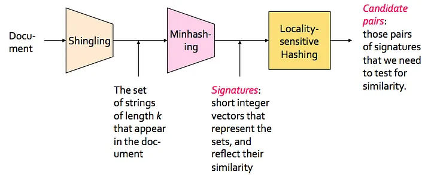

# Duplicate Detection Service


## Overview
This service employs MinHash and Locality-Sensitive Hashing (LSH) to identify duplicate documents. The functionality is exposed through the API endpoint /is_duplicate, enabling users to check if a given document duplicates any previously processed documents. The service is built on FastAPI, a modern and rapid web framework designed for creating APIs with Python 3.7+.




## Setup

1. **Create Virtual Environment:**
   ```bash
   sudo apt install python3.10-venv
   python3 -m venv venv
   ```

2. **Activate Virtual Environment:**
   ```bash
   source venv/bin/activate
   ```

3. **Install Requirements:**
   ```bash
   pip install -r requirements.txt
   ```

To run the Docker container locally:

```bash
docker run -d --name duplicateservice -v /etc/hosts:/etc/hosts -v /home/omgili/log/:/home/omgili/log/ -p 9039:9039 --hostname $(hostname) webzio/duplicateservice:latest_tag
```

Replace `latest_tag` with the specific tag you want to use for the Docker image.

## Algorithm
The Duplicate Detection Service utilizes MinHash and Locality-Sensitive Hashing (LSH) algorithms. MinHash generates a fixed-size signature for documents based on their content, while LSH hashes these signatures to efficiently find candidate duplicates or similarities. The LSH implementation includes a TTL (Time-to-Live) feature to automatically clean up expired entries, ensuring that outdated data does not affect the duplicate detection process.


## Service Details
- **API Endpoint**: `/is_duplicate`
  - **Description**: Accepts POST requests with document data to check for duplicates or similarities.
  
- **Health Check Endpoint**: `/health_check`
  - **Description**: Returns a simple JSON response to indicate the service status.

## RabbitMQ Consumer
The RabbitMQ consumer (`rabbit_consumer.py`) listens to a queue (`SyndicationQueue`) and processes incoming documents for duplicate detection:
- Retrieves documents from RabbitMQ.
- Computes document signatures using MinHash.
- Checks for duplicates using an external Duplicate Detection Service.
- Stores duplicate or similar documents in Redis.
- Redis Integration: Utilizes Redis for caching and managing LSH objects with TTL to handle document expiration efficiently.

